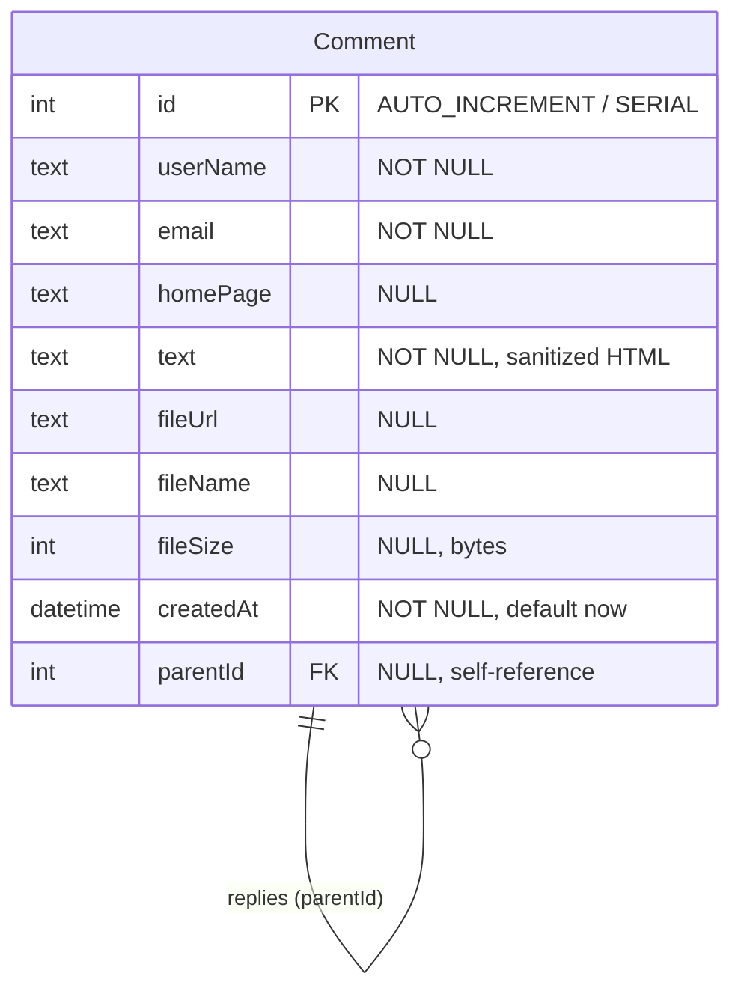

# Database schema — comments-spa

Артефакты схемы БД для сдачи тестового задания (ROADMAP #5).

**Runtime:** PostgreSQL (см. `backend/prisma/schema.prisma`).  
**Модель MySQL Workbench:** логический эквивалент в MySQL-типах для ER-диаграммы и forward engineering.

## Файлы

| Файл | Назначение |
|------|------------|
| [`comments-spa.mwb`](./comments-spa.mwb) | Модель MySQL Workbench (EER + таблица `Comment`) |
| [`schema.sql`](./schema.sql) | DDL PostgreSQL — соответствует Prisma-миграциям |
| [`schema.mysql.sql`](./schema.mysql.sql) | DDL MySQL 8.x — эквивалент для Workbench |
| [`scripts/build_mwb.py`](./scripts/build_mwb.py) | Пересборка `.mwb` из описания схемы |

## ER-диаграмма



Одна таблица `Comment` с self-referencing FK `parentId → id` (`ON DELETE CASCADE`) для каскадных replies.

## Поля `Comment`

| Поле | PostgreSQL | MySQL (Workbench) | Описание |
|------|------------|-------------------|----------|
| `id` | `SERIAL` PK | `INT` PK AI | Идентификатор |
| `userName` | `TEXT` NOT NULL | `TEXT` NOT NULL | Имя пользователя |
| `email` | `TEXT` NOT NULL | `TEXT` NOT NULL | E-mail |
| `homePage` | `TEXT` | `TEXT` | Homepage URL (optional) |
| `text` | `TEXT` NOT NULL | `TEXT` NOT NULL | HTML-текст (sanitized) |
| `fileUrl` | `TEXT` | `TEXT` | Путь к загруженному файлу |
| `fileName` | `TEXT` | `TEXT` | Оригинальное имя файла |
| `fileSize` | `INTEGER` | `INT` | Размер файла (байты) |
| `createdAt` | `TIMESTAMP(3)` | `DATETIME(3)` | Дата создания |
| `parentId` | `INTEGER` FK | `INT` FK | Родительский комментарий |

## MySQL Workbench

1. Откройте [`comments-spa.mwb`](./comments-spa.mwb) в [MySQL Workbench](https://dev.mysql.com/downloads/workbench/) 8.x.
2. На вкладке **EER Diagram** — таблица `Comment` со self-FK для replies.
3. **Database → Forward Engineer…** — сгенерирует SQL по `schema.mysql.sql`.

**Если `.mwb` не открывается:** **File → Import → Reverse Engineer MySQL Create Script…** → выберите [`schema.mysql.sql`](./schema.mysql.sql) → сохраните модель как `comments-spa.mwb`.

Пересборка `.mwb` после изменения схемы:

```bash
python3 docs/db-schema/scripts/build_mwb.py
```

Скрипт использует XML-генератор (совместим с MySQL Workbench). Если установлен MySQL Workbench, можно также выполнить `scripts/create_model_wb.py` через **Scripting → Run Workbench Script File** в GUI Workbench.

> **Примечание:** приложение использует PostgreSQL; `.mwb` и `schema.mysql.sql` — документационный артефакт с логически эквивалентной моделью. Канонический источник для runtime — `backend/prisma/schema.prisma` и `schema.sql`.

## Связь с Prisma

| Prisma | SQL |
|--------|-----|
| `backend/prisma/schema.prisma` | Модель `Comment` |
| `backend/prisma/migrations/` | Инкрементальные миграции |
| `docs/db-schema/schema.sql` | Консолидированный DDL |

После изменения Prisma-схемы обновите `schema.sql`, `schema.mysql.sql` и пересоберите `.mwb`.
